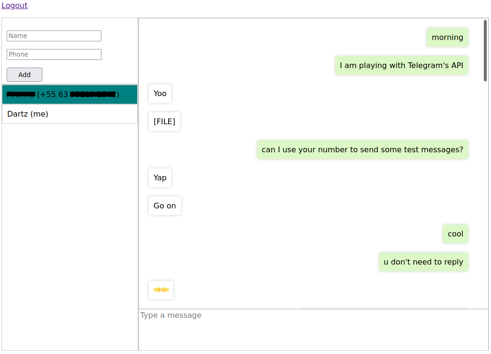

# Connector
Mutant Interview

# Como subir o ambiente:

Clone o repositório:

```bash
git clone https://github.com/samuelviveiros/connector.git
```

Entre no diretório do projeto:

```bash
cd connector
```

Crie um ambiente virtual:

```bash
python3 -m venv env
source env/bin/activate
```

Atualize o Pip e instale as dependências:

```bash
pip install --upgrade pip
pip install -U -r requirements.txt
```

Crie um arquivo `.env` com o conteúdo a seguir (substitua os valores onde for necessário):

```bash
SECRET_KEY=put-in-here-some-django-secret-key
API_ID=put-your-telegram-api-id-here
API_HASH=put-your-telegram-api-hash-here
PHONE=+556312345678
```

Para obter um `API_ID` e `API_HASH` basta acessar o endereço do Telegram https://my.telegram.org/.

Tendo configurado as variáveis de ambiente, execute o script a seguir. Esse script irá gerar um arquivo de sessão de login do Telegram na pasta raíz do projeto. Ao executá-lo, será solicitado a você um número de telefone que você utiliza no Telegram. Logo após fornecer o número de telefone, será enviado para a sua conta Telegram um código de login (basta acessar o Telegram no seu smartphone para visualizar), que você fornecerá para o script quando ele solicitar o código:

```bash
chmod u+x start_telegram_session.py
./start_telegram_session.py
```

Execute os comandos do Django abaixo:

```bash
python manage.py migrate
python manage.py createsuperuser
python manage.py runserver 0.0.0.0:8080
```

Por fim, acesse o endereço http://127.0.0.1:8080/, faça login, cadastre um contato do Telegram e tente enviar e receber mensagens.

# Funcionalidades pendentes (não deu tempo de fazer):
- Montar um stack com Django + Vunicorn/Gunicorn + PostgreSQL + Nginx
- Configurar HTTPS com Let's Encrypt
- Usar Websockets para facilitar o envio e recebimento de mensagens entre browser e backend
- Pesquisar uma solução efetiva para que a aplicação consiga logar nos servidores do Telegram
- Garantir a entrega das mensagens, caso a aplicação falhe ou a API do Telegram falhe
- Subir vídeos para o TikTok (embora opcional)
- Publicar a aplicação na nuvem (ou na minha VPS particular)

# Abaixo segue uma imagem da página do conector:

